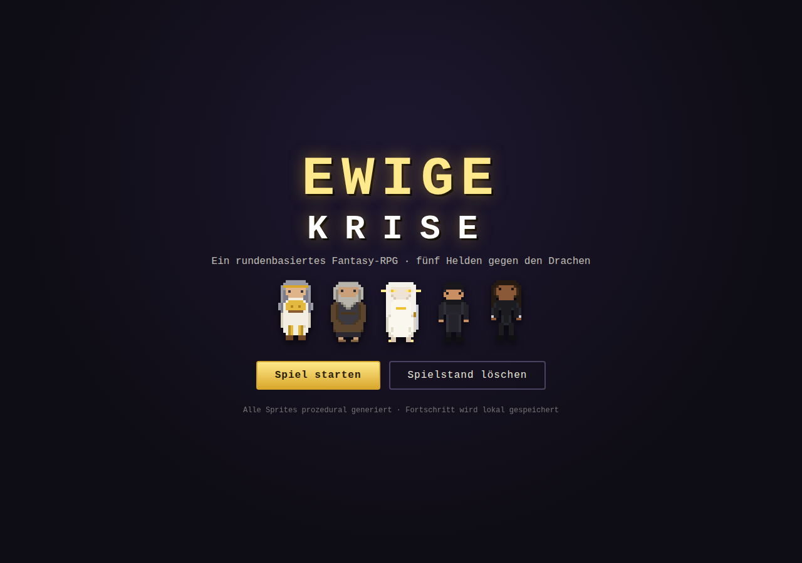
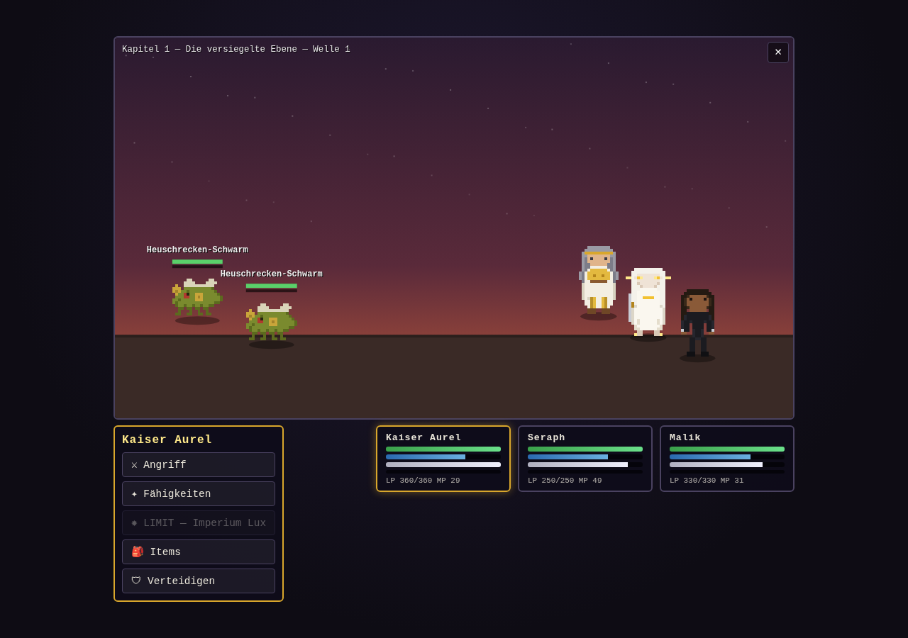
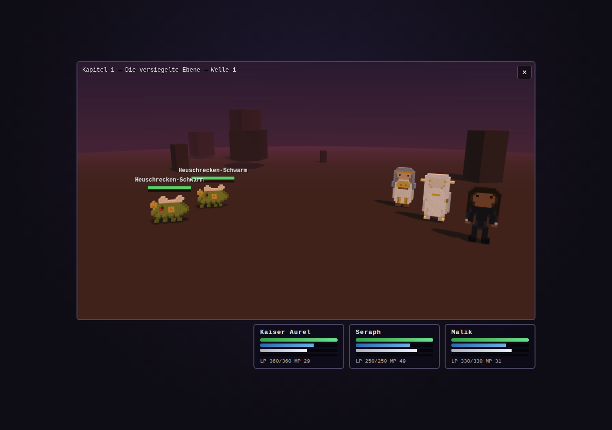

# EWIGE KRISE — Rundenbasiertes RPG

Ein browserbasiertes, rundenbasiertes Fantasy-RPG mit Active-Time-Battle-System,
inspiriert von der Kampfmechanik moderner Mobile-JRPGs. Alle Charaktere,
Namen, Sprites und Inhalte sind Eigenkreationen — die fünf Helden basieren
auf eigenen Character-Design-Sheets, sämtliche Sprites werden zur Laufzeit
prozedural aus Pixel-Maps generiert (keine externen Assets, keine Abhängigkeiten).





## Spielen

Einfach `index.html` (2D) oder `3d.html` (3D) im Browser öffnen —
kein Build, kein Server nötig. Beide Versionen teilen sich denselben
Spielstand, dieselben Helden und dieselbe Kampflogik.

```bash
# optional mit lokalem Server:
cd ewige-krise
python3 -m http.server 8080
# → http://localhost:8080
```

## Spielablauf

1. **Gruppe wählen** — 3 von 5 Helden
2. **Kapitel wählen** — 3 Kapitel, jeweils 3 Wellen mit Boss am Ende
3. **Kämpfen** — Sieg bringt EP, Gold, Items und schaltet das nächste Kapitel frei

Der Fortschritt (Level, EP, Gold, Items, freigeschaltete Kapitel) wird
automatisch im `localStorage` gespeichert.

## Kampfsystem (ATB im Warte-Modus)

- **ATB-Leiste** füllt sich in Echtzeit abhängig vom Tempo-Wert; ist sie voll,
  darf die Einheit handeln. Solange ein Befehlsmenü offen ist, pausiert die Zeit.
- **Befehle:** Angriff (lädt MP auf), Fähigkeiten (kosten MP), Items,
  Verteidigen (halbiert Schaden, lädt MP), Limit.
- **Bruch-Leiste:** Jeder Treffer füllt die orangene Leiste des Gegners —
  Treffer auf **Schwächen** deutlich stärker. Ist sie voll, ist der Gegner
  **erschüttert**: Er kann nicht handeln und erleidet +50 % Schaden.
- **Limit-Leiste:** Füllt sich durch ausgeteilten und erlittenen Schaden.
  Bei 100 % steht die Limit-Technik des Helden bereit.
- **Elemente:** Physisch, Feuer, Blitz, Erde, Licht, Schatten —
  mit Schwächen (×1,5) und Resistenzen (×0,5) pro Gegner.
- **Boss-Aufladungen:** Bosse telegrafieren schwere Angriffe eine Runde
  vorher (⚠) — Zeit zum Verteidigen oder Heilen.

## Die fünf Helden

| Held | Rolle | Design-Vorlage | Limit |
|------|-------|----------------|-------|
| **Kaiser Aurel** | Wächter (Tank) | Herrscher mit Lorbeerkranz, Goldrüstung, weiße Robe | Imperium Lux |
| **Prophet Elior** | Seher (Heiler) | Alter Prophet, grauer Bart, dunkle Robe | Posaunenschall |
| **Seraph** | Klinge (Magier) | Weißes Lockenhaar, glühende Augen, Schwert der Wahrheit | Klinge der Wahrheit |
| **Kade** | Schatten (Schnelle DPS) | Junger Mann im schwarzen Mantel | Nachtsturm |
| **Malik** | Brecher (Bruch-Spezialist) | Kämpfer mit Dreadlocks, ganz in Schwarz | Titanenfaust |

## Projektstruktur

```
ewige-krise/
├── index.html        — 2D-Version (Bildschirme: Titel, Gruppe, Kapitel, Kampf, Ergebnis)
├── 3d.html           — 3D-Version (gleiche Bildschirme, WebGL-Kampfszene)
├── style.css         — komplettes Styling (beide Versionen)
├── vendor/
│   └── three.min.js  — Three.js r149 (UMD, lokal gebündelt — läuft offline)
└── src/
    ├── sprites.js    — Sprite-Engine: Pixel-Maps → Canvas (inkl. Spiegelung, Blitz-Silhouetten)
    ├── data.js       — Helden, Fähigkeiten, Limits, Gegner, Kapitel, Items
    ├── battle.js     — 2D-ATB-Kampf-Engine, Animationen, Canvas-Rendering
    ├── battle3d.js   — 3D-ATB-Kampf-Engine: Voxel-Figuren, Three.js-Szene, 2D-Overlay
    └── main.js       — Bildschirm-Logik, Befehlsmenüs, HUD, Speicherstand (beide Engines)
```

## Technik

- Pures HTML/CSS/JavaScript; einzige Abhängigkeit ist das lokal
  gebündelte Three.js für die 3D-Version
- Sprites: Pixel-Maps (Zeichen → Palettenfarbe), gerendert auf Canvas mit
  `image-rendering: pixelated`; automatisch generierte gespiegelte und
  weiße (Treffer-Blitz-)Varianten
- **3D-Version:** Dieselben Pixel-Maps werden zu Voxel-Figuren extrudiert
  (jedes Pixel → 3 Würfel Tiefe als `InstancedMesh`) und in einer
  Three.js-Diorama-Szene gerendert — mit Kapitel-Himmel als Verlaufstextur,
  Nebel, Schatten, Kulissen-Felsen, Kameraschwenk und Treffer-Shake.
  Schadenszahlen, Gegner-Balken und Partikel laufen über ein transparentes
  2D-Overlay-Canvas; die Zielwahl klickt über projizierte Bildschirmpositionen.
  Beide Engines implementieren dieselbe API (`Battle.start/stop/befehlAusfuehren`),
  daher ist `main.js` für 2D und 3D identisch.
- Kampf-Rendering auf einem 960×540-Canvas, UI als DOM-Overlay
- Responsive bis hinunter zu Mobilgeräten
