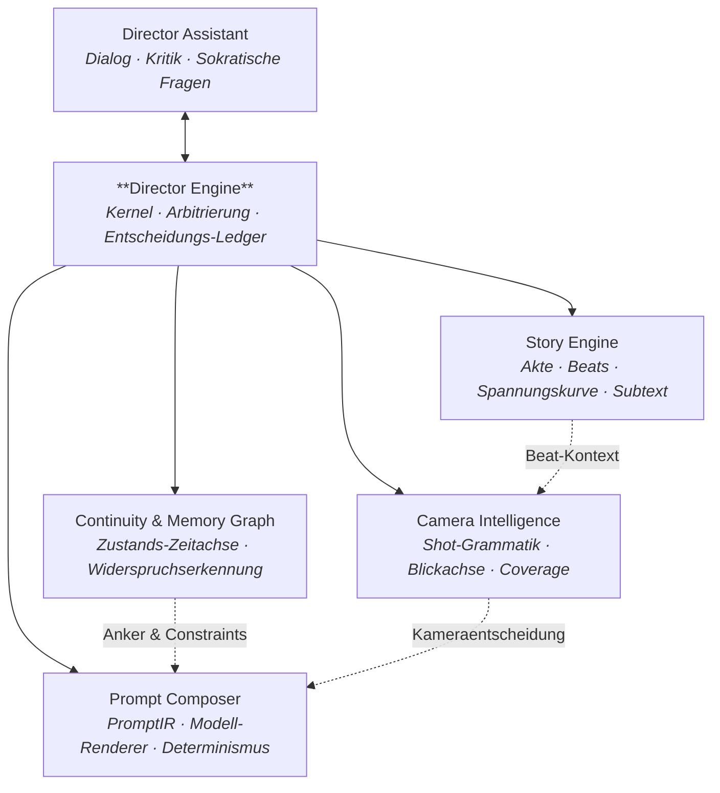

# SOULINK — Director Operating System

> **Kein Bildgenerator. Ein Regie-Betriebssystem.**
> SOULINK erzeugt keine Bilder, die zufällig gut aussehen. Es trifft Regie-Entscheidungen,
> begründet sie, hält sie konsistent — und rendert sie erst danach.

**Plattform:** iPad (iPadOS 18+, SwiftUI, Apple Pencil) · **Status:** Architekturphase — noch kein Produktionscode.

---

## Warum SOULINK existiert

Der heutige Stand generativer Bildwerkzeuge ist ein *Slot-Machine-Workflow*: Prompt rein,
Würfel fallen, hübsches Einzelbild raus. Was fehlt, ist alles, was Film ausmacht —
Anschluss, Blickachse, Spannungskurve, Subtext, Motivation. Zehn schöne Bilder ergeben
keine Szene. Sie ergeben ein Moodboard.

SOULINK dreht die Kausalität um:

```
Konventionell:   Prompt  →  Bild  →  (hoffentlich) Bedeutung
SOULINK:         Absicht →  Dramaturgie → Kamera → Kontinuität → Prompt → Bild
```

Das Bild ist das *letzte* Glied der Kette, nicht das erste. Jedes Artefakt im System
trägt die Begründung mit sich, aus der es entstanden ist.

---

## Die vier Grundprinzipien

Diese vier Sätze sind keine Slogans. Sie sind **Systeminvarianten**, technisch erzwungen
(siehe [Regie-Doktrin](docs/00-REGIE-DOKTRIN.md)):

| Prinzip | Technische Erzwingung |
|---|---|
| **Jedes Panel hat genau eine Aufgabe.** | `Panel.narrativeJob` ist ein einzelner, nicht-optionaler Wert. Der Validator lehnt Doppelaufgaben ab und schlägt einen Split vor. |
| **Jede Kamera verfolgt einen erzählerischen Zweck.** | Kameraparameter werden *ausschließlich* aus `CameraIntent` abgeleitet. Es gibt keinen Pfad, der Parameter ohne Intent erzeugt. |
| **Jede Fortsetzung ist dramaturgisch begründet.** | `ContinuationOption` erfordert einen `DramaturgicalBasis` (adressierter Spannungsvektor, Strategie-Archetyp, erwartetes Spannungsdelta). |
| **Jede Entscheidung braucht ein klares Warum.** | `Rationale` ist Pflichtfeld jeder persistierten Entscheidung. Das *Rationale Gate* der Director Engine verwirft alles ohne. |

---

## Die sechs Pflichtmodule



| Modul | Eine-Zeile-Verantwortung |
|---|---|
| **Director Engine** | Der Kernel. Nimmt Vorschläge entgegen, arbitriert Konflikte, erzwingt Invarianten, schreibt das Entscheidungs-Ledger. |
| **Story Engine** | Dramaturgie: Story-Spine, Beat-Struktur, Spannungskurve, Figurenbögen, Subtext, Thema. |
| **Camera Intelligence** | Filmsprache: leitet aus erzählerischer Absicht Einstellungsgröße, Achse, Höhe, Optik, Bewegung und Anschluss-Regeln ab. |
| **Continuity & Memory Graph** | Das Gedächtnis: Wer trägt was, wo, wann, mit welcher Verletzung, bei welchem Licht — und was widerspricht sich. |
| **Prompt Composer** | Übersetzt validierte Entscheidungen deterministisch in eine modellneutrale `PromptIR` und von dort in modell-spezifische Prompts. |
| **Director Assistant** | Der Co-Regisseur im Dialog: stellt die richtige Frage, widerspricht, bietet Optionen mit Begründung. |

---

## Das Flaggschiff-Feature: Referenzbild → begründete Fortsetzung

Ein Bild rein — sieben Analysestufen — mehrere *strategisch unterschiedliche*
Fortsetzungen, jede mit Begründung, Kameralogik, Kontinuitätsbedingungen,
Übergang und fertigem Prompt.

Die Optionen sind nicht gesampelt, sondern **konstruiert**: Jede Option muss einen
anderen Strategie-Archetyp (Eskalation, Enthüllung, Umkehrung, Verzögerung, Kontrast,
Annäherung, Konsequenz) *und* eine andere Kamerarelation belegen. Das ist die technische
Garantie gegen Zufallsergebnisse.

→ Vollständige Spezifikation inkl. durchgerechnetem Beispiel:
[07-REFERENZ-FORTSETZUNG.md](docs/07-REFERENZ-FORTSETZUNG.md)

---

## Dokumentenkarte

Lesereihenfolge für neue Mitwirkende: **00 → 01 → 02 → 07**, danach nach Bedarf.

| # | Dokument | Inhalt |
|---|---|---|
| 00 | [Regie-Doktrin](docs/00-REGIE-DOKTRIN.md) | Die Invarianten und wie sie erzwungen werden. Verbindlich für alle Module. |
| 01 | [PRD](docs/01-PRD.md) | Vision, Nutzer, Jobs-to-be-done, funktionale und nicht-funktionale Anforderungen, Erfolgsmetriken, Nicht-Ziele. |
| 02 | [Systemdesign](docs/02-SYSTEMDESIGN.md) | Schichten, deterministischer Kern, Entscheidungs-Ledger, Model Gateway, Nebenläufigkeit, Persistenz. |
| 03 | [Modulspezifikationen](docs/03-MODULE.md) | Die sechs Pflichtmodule im Detail: Schnittstellen, Regelwerke, Fehlermodi, Erweiterungspunkte. |
| 04 | [Datenmodell](docs/04-DATENMODELL.md) | Entitäten, Beziehungen, Typskizzen, JSON-Beispiele, Versionierung. |
| 05 | [Agentenstruktur](docs/05-AGENTEN.md) | Agenten-Roster, Verträge, Orchestrierung, Schema-Zwang, Reparaturschleife, Budgets. |
| 06 | [UX / iPad](docs/06-UX-IPAD.md) | Layout, Modi, Pencil, Gesten, Screens, Reasoning Inspector, Barrierefreiheit. |
| 07 | [Referenz & Fortsetzung](docs/07-REFERENZ-FORTSETZUNG.md) | Die 7-stufige Bildanalyse und die Fortsetzungssynthese, mit Beispiel. |
| 08 | [Qualität & NFR](docs/08-QUALITAET-NFR.md) | Teststrategie, Eval-Harness, Guardrails, Recht, Kosten, Performance-Budgets. |
| 09 | [Roadmap](docs/09-ROADMAP.md) | Phasen P0–P6 mit Scope, Exit-Kriterien und Risiken. |
| 10 | [ADRs](docs/10-ADR.md) | Architekturentscheidungen mit Kontext, Alternativen und Konsequenzen. |

**Schemata:** [`schemas/`](schemas/) enthält die JSON-Schemata für `Rationale`,
`ContinuationOption` und `PromptIR` — die drei Verträge, an denen das ganze System hängt.

---

## Architektur-Kurzfassung in fünf Sätzen

1. **Deterministischer Kern, probabilistische Peripherie.** Regelwerke (Shot-Grammatik,
   Kontinuität, Spannungsmathematik) sind gewöhnlicher, testbarer Swift-Code. Modelle
   liefern nur Interpretationen und Vorschläge — nie den finalen Zustand.
2. **Alles geht durch das Rationale Gate.** Ein Vorschlag ohne prüfbares Warum wird
   verworfen, nicht durchgewinkt.
3. **Der Projektzustand ist ein Fold über ein Entscheidungs-Ledger.** Damit ist jedes
   Ergebnis reproduzierbar, rückspulbar und erklärbar.
4. **`PromptIR` trennt Regie von Modell.** Modelle sind Renderer hinter einem Gateway;
   ein Modellwechsel ist ein neuer Adapter, keine Domänenänderung.
5. **Der Regie-Korpus ist Daten, kein Code.** Filmsprachregeln liegen als versionierte
   Regeldateien vor und sind ohne Rebuild erweiterbar.

---

## Was SOULINK *nicht* ist

- Kein Bildeditor und kein NLE — SOULINK plant und begründet, es schneidet nicht final.
- Kein Stil-Kopierer bekannter Künstler oder Filme (siehe [08](docs/08-QUALITAET-NFR.md), Abschnitt Recht).
- Kein „Ein Klick, fertiger Film" — es ist ein Regie-Instrument, kein Ersatz für Regie.
- Kein Cloud-Zwang: Analyse und Planung laufen lokal, nur Generierung braucht ein Modell.
