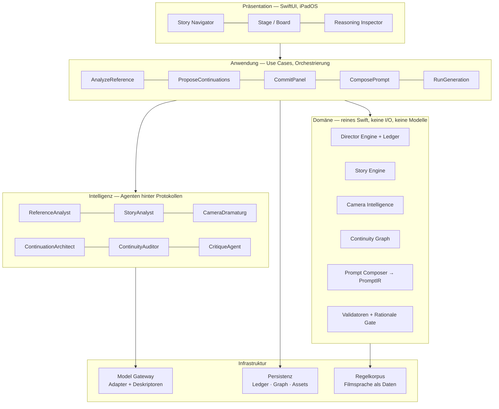
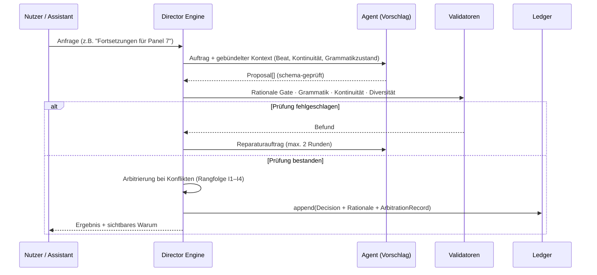
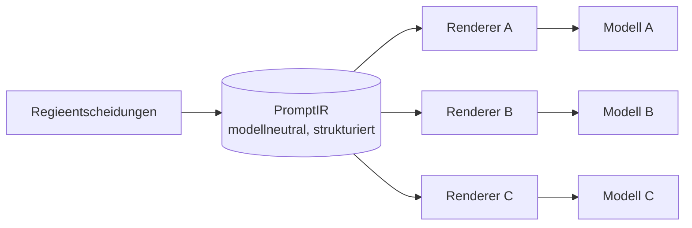

# 02 — Systemdesign

> Wie SOULINK gebaut ist, damit die Doktrin aus [00](00-REGIE-DOKTRIN.md) nicht nur gemeint,
> sondern erzwungen ist.

---

## 1. Leitprinzip: Deterministischer Kern, probabilistische Peripherie

Die wichtigste Entscheidung des gesamten Systems:

> **Modelle interpretieren und schlagen vor. Sie besitzen niemals den Zustand.**

| | Deterministisch (gewöhnlicher Swift-Code, unit-testbar) | Probabilistisch (Modelle) |
|---|---|---|
| **Was** | Shot-Grammatik, Achsenlogik, Spannungsmathematik, Kontinuitätsauflösung, Prompt-Komposition, Validierung, Diversitätsprüfung | Bildverständnis, Textinterpretation, Vorschlagsformulierung, Bildgenerierung |
| **Eigenschaft** | Reproduzierbar, erklärbar, offline, schnell | Kreativ, unscharf, netzabhängig, teuer |
| **Rolle** | **Entscheidet und speichert** | **Schlägt vor und formuliert** |

Ein Modell darf sagen: „Ich sehe eine untersichtige Naheinstellung mit Machtgefälle zugunsten
der linken Figur." Es darf **nicht** sagen: „Also ist die Achse jetzt bei 47°." Achsen,
Zustände und Anschlüsse berechnet der Kern.

Praktische Konsequenz: Fällt das Netz aus, verliert SOULINK Vorschläge und Bilder — aber
keine Struktur, keine Prüfung und keine Begründung, die bereits im Ledger steht.

---

## 2. Schichten



**Abhängigkeitsregel.** Pfeile zeigen nur nach unten oder zur Seite in Richtung Domäne.
Die Domäne importiert **nichts** aus Intelligenz oder Infrastruktur. Erzwungen durch:
Modulgrenzen (separate Swift-Packages) und eine Lint-Regel, die Anbieter- und Modellnamen
in `Domain` verbietet.

**Package-Schnitt:**

```
SoulinkDomain        (0 Abhängigkeiten — Foundation only)
SoulinkRules         (Regelkorpus-Loader + Regelmodelle)
SoulinkAgents        (Agentenverträge + Implementierungen)
SoulinkGateway       (ModelGateway, Adapter je Anbieter)
SoulinkPersistence   (Ledger-Store, Graph-Store, Asset-Store)
SoulinkApp           (SwiftUI, Use Cases, Komposition)
```

---

## 3. Der Kernel: Director Engine

Die Director Engine ist **kein Agent**. Sie ist eine deterministische Zustandsmaschine.
Sie ist die einzige Instanz, die den Projektzustand ändern darf.



### 3.1 Entscheidungs-Ledger (Event Sourcing)

```
ProjectState = ledger.reduce(EmptyState) { state, decision in apply(decision, to: state) }
```

Warum Event Sourcing hier und nicht ein einfaches Dokumentmodell:

1. **Erklärbarkeit ist kein Extra, sondern Speicherform.** Das Warum liegt *im* Ereignis,
   nicht in einem Nebenlog, das driften kann.
2. **Zeitreise und Verzweigung** (FR-DE-04) sind eine natürliche Folge, keine Nachrüstung.
3. **Reproduzierbarkeit** (I5): Ein `decisionLedgerCursor` genügt, um den exakten
   Erzeugungskontext eines Bildes wiederherzustellen.
4. **Konfliktdiagnose:** „Seit welcher Entscheidung ist die Achse gebrochen?" ist eine
   Suchanfrage, keine Detektivarbeit.

**Kosten und Gegenmaßnahme:** Ledger-Wiedergabe wird bei großen Projekten teuer.
Gegenmaßnahme: **Snapshots** alle N Entscheidungen (`StateSnapshot`), Wiedergabe nur ab
letztem Snapshot. Snapshots sind ein Cache und dürfen jederzeit verworfen werden.

**Entscheidungstypen (Auszug):** `CreateScene`, `SetBeat`, `SetPanelJob`, `DeriveCamera`,
`OverrideCamera`, `AssertContinuityFact`, `RecordStateChange`, `AcceptContinuation`,
`ComposePrompt`, `RunGeneration`, `MarkIntentionalViolation`, `Branch`.

### 3.2 Arbitrierung

Bei Widersprüchen zwischen Modulen entscheidet die Rangfolge aus [00](00-REGIE-DOKTRIN.md):
Kontinuität > Dramaturgie > Filmsprache > Ästhetik. Jede Auflösung erzeugt:

```
ArbitrationRecord { winner, loser, rule, cost, rationale }
```

`cost` beschreibt in einem Satz, was die Entscheidung geopfert hat — „Die Intimität der
Naheinstellung geht verloren, um die Achse zu wahren." Diese Zeile ist Produkt, nicht Log.

---

## 4. Datenfluss: Von der Absicht zum Bild

```mermaid
flowchart LR
    REF[Referenzbild] --> RA[ReferenceAnalyst<br/>7 Stufen]
    RA --> TV[Spannungsvektoren]
    PREM[Prämisse / Beat] --> SE[Story Engine]
    SE --> BEAT[Beat mit Funktion,<br/>Wertwechsel, Subtext]
    TV --> CA[ContinuationArchitect]
    BEAT --> CA
    CA --> OPT[Optionsset<br/>strategisch divers]
    OPT --> DIV{Diversitäts-<br/>prüfung}
    DIV -- verletzt --> CA
    DIV -- ok --> SEL[Nutzerwahl]
    SEL --> PJ[Panel + PanelJob]
    PJ --> CI[Camera Intelligence<br/>Intent → Grammatik → Parameter]
    CI --> GA{Grammatik-<br/>Audit}
    GA --> CG[Continuity Graph<br/>Anker + Constraints]
    CG --> CC{Kontinuitäts-<br/>audit}
    CC --> PC[Prompt Composer]
    PC --> IR[(PromptIR)]
    IR --> RND[Modell-Renderer]
    RND --> MG[Model Gateway]
    MG --> IMG[Bild]
    IMG --> POST[VLM-Post-Check:<br/>hält das Bild die Anker?]
    POST -.Abweichung.-> CG
```



Der Rückkanal ganz rechts ist wichtig: Das erzeugte Bild wird gegen seine eigenen
Kontinuitätsanker geprüft. Weicht es ab, ist das ein **Befund**, kein Achselzucken — der
Nutzer sieht, dass das Modell die Vorgabe nicht gehalten hat, und kann neu würfeln,
Anker verstärken oder den Fakt aktualisieren.

---

## 5. Model Gateway — Austauschbarkeit (I6)

### 5.1 Fähigkeits-Routing

Kein Aufruf nennt ein Modell. Ein Aufruf nennt eine **Fähigkeit** und **Anforderungen**:

```
gateway.execute(
    capability: .imageGeneration,
    requires: [.referenceConditioning, .seedControl, .aspect(2.39)],
    prefers:  [.lowLatency],
    budget:   .init(maxCost: .medium, maxLatency: .seconds(40))
)
```

Das Gateway wählt anhand der registrierten `ModelDescriptor`s:

```
ModelDescriptor
├── id, anbieter, version
├── capabilities: Set<Capability>        // textReasoning, visionAnalysis, imageGeneration,
│                                        // videoGeneration, embedding, inpainting …
├── controls: Set<Control>               // seedControl, referenceConditioning, poseControl,
│                                        // depthControl, maskControl, multiImageRef
├── limits: Limits                       // Kontext, max. Auflösung, Seitenverhältnisse
├── economics: Economics                 // Kosten/Aufruf, typ. Latenz
├── determinism: DeterminismProfile      // seedStabil? promptStabil?
└── renderer: PromptRendererID           // welcher Adapter die IR übersetzt
```

### 5.2 PromptIR als Isolationsschicht



Die IR beschreibt **was im Bild gilt** (Subjekt, Handlung, Kameraparameter, Licht,
Kontinuitätsanker, Ausschlüsse, Stilprofil, Seitenverhältnis), nicht **wie man es formuliert**.
Prompt-Dialekte, Gewichtungssyntax, Parameterflaggen und Reihenfolge-Vorlieben leben
ausschließlich im Renderer.

Schema: [`schemas/prompt-ir.schema.json`](../schemas/prompt-ir.schema.json)

### 5.3 Fähigkeits-Degradation

Fehlt eine Fähigkeit, wird nicht still verzichtet, sondern **kompensiert und markiert**:

| Fehlende Fähigkeit | Kompensation | Markierung |
|---|---|---|
| `referenceConditioning` | Kontinuitätsanker textuell verstärken, Kanon-Formulierung wörtlich wiederholen | `FidelityRisk.identityDrift(.high)` |
| `seedControl` | Reproduzierbarkeit nur bis Prompt-Ebene garantieren | `FidelityRisk.nonReproducible` |
| `aspect(2.39)` | Nächstes unterstütztes Verhältnis + geplanter Beschnitt in der IR vermerken | `FidelityRisk.framingShift(.low)` |
| `poseControl` | Blocking sprachlich präzisieren, Grundriss als Referenzbild anhängen falls möglich | `FidelityRisk.blockingDrift(.medium)` |

`FidelityRisk` erscheint im UI am Panel — der Regisseur weiß vorher, wo das Modell schwächelt.

### 5.4 Konformitätstests je Adapter

Jeder Adapter muss dieselbe Testsuite bestehen (siehe [08](08-QUALITAET-NFR.md)):
IR-Rendering deterministisch, Fähigkeitsdeklaration ehrlich (deklarierte Controls werden
tatsächlich angewandt), Fehlerübersetzung vollständig, Timeout-/Retry-Verhalten korrekt.

---

## 6. Regelkorpus als Daten

Filmsprachregeln, Strukturvorlagen und Strategie-Archetypen sind **versionierte Datendateien**,
kein Code:

```
rules/
├── shot-grammar.v3.yaml        # Intent → Parameterbereiche, Begründungstexte, Quellen
├── continuity-rules.v2.yaml    # Konflikttypen, Schweregrade, Auflösungsvorschläge
├── story-templates.v2.yaml     # Drei-Akt, Kishōtenketsu, Sequenzmodell …
├── strategy-archetypes.v1.yaml # Eskalation, Enthüllung, Umkehrung, …
└── transition-grammar.v1.yaml  # Schnittarten, Bedingungen, Wirkung
```

Jede Regel trägt: `id`, `bedingung`, `wirkung`, `begründungstext`, `herkunft` (Quelle/Konvention),
`schweregrad`, `überschreibbar`. Ein Projekt kann Regeln überschreiben (`ProjectRuleOverlay`) —
etwa ein Stil, der bewusst permanent Achsensprünge nutzt. Der Overlay ist Teil des Ledgers
und damit selbst begründungspflichtig.

**Warum Daten und nicht Code:** Filmsprache ist historisch, kulturell und genrespezifisch.
Ein Regelkorpus, der einen Rebuild braucht, wird nie gepflegt. Ein Korpus als Datei kann
ein Fachautor pflegen, wir können ihn diffen, und ein Nutzer kann ihn für sein Genre forken.

---

## 7. Nebenläufigkeit

- **Swift Concurrency, strict.** Die Director Engine ist ein `actor` — sie serialisiert alle
  Zustandsänderungen. Damit sind Race Conditions am Ledger konstruktiv ausgeschlossen.
- **Domänentypen sind `Sendable` Werttypen** (structs, enums). Kein geteilter veränderlicher Zustand.
- **Agentenaufrufe laufen parallel** in einer `TaskGroup`, wo sie unabhängig sind
  (Analysestufen 1–4 des Referenzbildes), und sequenziell, wo sie aufeinander aufbauen (5–7).
- **Abbruch ist Pflicht:** Jeder Agentenaufruf ist kooperativ abbrechbar; verlässt der Nutzer
  den Kontext, werden Aufträge storniert (auch beim Anbieter, wo möglich — Kostenkontrolle).
- **UI blockiert nie.** Lange Läufe erscheinen als Karten mit Stufen-Fortschritt im Inspector.

---

## 8. Persistenz

| Speicher | Inhalt | Technik | Begründung |
|---|---|---|---|
| **Ledger-Store** | Append-only Entscheidungen | JSONL im Projektpaket + Index | Append-only passt zum Zugriffsmuster; textbasiert, diffbar, migrierbar |
| **Snapshots** | Materialisierter Zustand alle N Entscheidungen | Binär (Codable) | Wiedergabekosten begrenzen; jederzeit verwerfbar |
| **Memory Graph** | Entitäten, Zustandsänderungen, Fakten | SwiftData (Knoten/Kanten) | Beziehungsabfragen, Prädikate, iPad-nativ |
| **Assets** | Referenz- und generierte Bilder | Dateien im Paket, inhaltsadressiert (SHA-256) | Deduplizierung, stabile Referenzen im Ledger |
| **Analysen** | Referenzbildbefunde | JSON neben dem Asset | Nachvollziehbar, exportierbar, versionierbar |

**Projektformat:** ein Paket (`.soulink`) — sichtbar in der Dateien-App, teilbar, ohne
Serverabhängigkeit. Migration über `schemaVersion` je Datei plus Migrationskette.

---

## 9. Fehlerbehandlung

Vier Fehlerklassen mit unterschiedlichem UI-Verhalten:

| Klasse | Beispiel | Verhalten |
|---|---|---|
| **Regelbefund** | Achsensprung erkannt | Kein Fehler, sondern Regie-Information: Warnung mit Begründung + „bewusst so" - Option |
| **Vorschlagsfehler** | Agent liefert Schema-Bruch oder leere Rationale | Reparaturschleife (max. 2), dann degradierter Fallback + ehrlicher Hinweis |
| **Infrastrukturfehler** | Netz, Rate Limit, Timeout | Retry mit Backoff, Modellwechsel über Gateway falls Fähigkeit erfüllbar, sonst Warteschlange |
| **Integritätsfehler** | Ledger inkonsistent, Asset fehlt | Nur-Lese-Modus, Reparaturangebot, niemals stille Korrektur |

Grundsatz: **Nie stille Qualitätsminderung.** Wenn SOULINK weniger liefert als geplant,
sagt es das an der Stelle, wo es passiert.

---

## 10. Erweiterungspunkte

| Punkt | Wie erweitert | Ohne Änderung an |
|---|---|---|
| Neues Bildmodell | `ModelDescriptor` + `PromptRenderer` registrieren | Domäne, UI |
| Neue Filmsprachregel | Eintrag in `shot-grammar.yaml` | Code |
| Neue Strukturvorlage | Eintrag in `story-templates.yaml` | Code |
| Neuer Strategie-Archetyp | Eintrag in `strategy-archetypes.yaml` + Prompt-Fragment | Orchestrierung |
| Neuer Agent | Vertrag implementieren, in Registry eintragen | Director Engine |
| Neuer Exporter | `BoardExporter`-Protokoll | Domäne |
| Neue Entitätsart (z. B. Fahrzeugflotte) | Graph-Schema erweitern + Kanon-Vorlage | Kernlogik |
