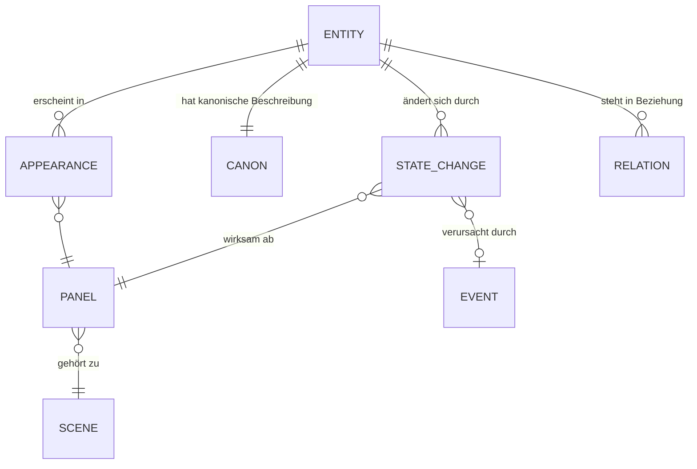

# 03 — Modulspezifikationen

Die sechs Pflichtmodule. Je Modul: Verantwortung, Schnittstelle, inneres Regelwerk,
Fehlermodi, Erweiterungspunkte.

Typskizzen sind **Spezifikation, kein Produktionscode** — sie legen Verträge fest, keine
Implementierung.

---

## 1. Director Engine

### Verantwortung
Kernel und einzige Schreibinstanz des Projektzustands. Nimmt Vorschläge entgegen, validiert
sie gegen die Doktrin, arbitriert Konflikte, schreibt das Ledger, beantwortet „warum".

**Nicht** verantwortlich: Kreativität. Die Engine erfindet nichts — sie entscheidet und
protokolliert.

### Schnittstelle

```swift
actor DirectorEngine {
    func submit(_ proposal: Proposal) async -> SubmissionResult
    func state(at cursor: LedgerCursor?) async -> ProjectState
    func explain(_ id: DecisionID) async -> ExplanationChain   // rekursiv bis zur Wurzel
    func branch(from cursor: LedgerCursor, named: String) async -> BranchID
    func arbitrations(for scope: Scope) async -> [ArbitrationRecord]
}

enum SubmissionResult {
    case accepted(DecisionID, effects: [Effect])
    case repairRequested(findings: [ValidationFinding], attempt: Int)
    case rejected(findings: [ValidationFinding])
}
```

### `explain` — die Begründungskette
Das differenzierendste Feature des Systems. `explain(panel7.camera)` liefert nicht einen Satz,
sondern die **Kette**:

```
Panel 7 ist eine Naheinstellung mit 85 mm, leicht untersichtig.
├── weil PanelJob = .reveal  → die Information muss ohne Kontext-Ablenkung lesbar sein
├── weil Beat B12 den Wertwechsel Vertrauen → Verrat trägt  (Story Engine)
├── weil die Vorgängereinstellung eine Halbtotale war  → Größensprung erfüllt (Grammatik R-042)
├── weil die Achse bei 118° liegt und Figur A links steht → Blickrichtung rechts (R-011)
└── verworfen: Große Nahaufnahme — hätte den Höhepunkt in B14 vorweggenommen
```

### Validierungsreihenfolge
Fail-fast in dieser Ordnung (billig vor teuer, hart vor weich):

1. **Schema** — strukturell gültig?
2. **Rationale Gate** — Vollständigkeit, Nicht-Zirkularität, Belegbarkeit (I4)
3. **Kontinuität** — harte Konflikte (höchste Rangstufe)
4. **Dramaturgie** — erfüllt der Beat seine Funktion?
5. **Grammatik** — Achse, Größensprung, Screen Direction, Bewegungsmotivation
6. **Diversität** — nur bei Optionssets (I3)

### Fehlermodi
| Modus | Verhalten |
|---|---|
| Agent liefert wiederholt ungültig | Nach 2 Reparaturrunden: Ablehnung mit sichtbarem Befund, kein Fallback-Rauschen |
| Zwei Module gleichrangig im Konflikt | Explizite Nutzerfrage mit beiden Begründungen — nie Münzwurf |
| Ledger-Wiedergabe schlägt fehl | Nur-Lese-Modus + Reparaturangebot ab letztem gültigen Snapshot |

---

## 2. Story Engine

### Verantwortung
Dramaturgie: Struktur, Beats, Wertwechsel, Spannungsverlauf, Subtext, Figurenbögen, Thema.
Sie beantwortet: *Was muss diese Einheit erzählerisch leisten?*

### Kernmodelle

**Story Spine** — die fünf Sätze, ohne die keine Szene entstehen darf:
Prämisse · dramatische Frage · Protagonistenziel · Antagonismus · Thema.
Fehlen sie, arbeitet SOULINK trotzdem, markiert aber jeden abgeleiteten Beat mit
`groundingWeakness` — die Begründungen werden sonst zwangsläufig generisch.

**Beat** — die Einheit der Dramaturgie:

```swift
struct Beat {
    let function: BeatFunction        // setup, disturbance, complication, turn,
                                      // crisis, climax, resolution, breather
    let valueShift: ValueShift        // z.B. .init(from: "Sicherheit", to: "Bedrohung")
    let tension: Double               // 0…1, gesetzt oder abgeleitet
    let subtext: Subtext              // said vs. meant vs. hidden
    let stakes: Stakes                // was steht konkret auf dem Spiel
    let pov: EntityID?                // wessen Erfahrung trägt den Beat
    let rationale: Rationale
}
```

**Der Wertwechsel ist Pflicht.** Ein Beat ohne `valueShift` ist per Definition kein Beat,
sondern Information. Die Engine lehnt ihn nicht ab, aber sie markiert ihn als
`inertBeat` — und der Director Assistant fragt nach.

### Spannungskurve — Diagnostik
Deterministische Analyse über die Beat-Folge:

| Befund | Erkennung | Vorschlag |
|---|---|---|
| **Plateau** | ≥ 4 Beats mit Δtension < 0,05 | Beat mit Gegenbewegung einziehen oder komprimieren |
| **Sägezahn** | Vorzeichenwechsel in ≥ 5 aufeinanderfolgenden Beats | Bögen bündeln — Wechsel verliert Wirkung |
| **Fehlender Tiefpunkt** | min(tension) > 0,35 vor Klimax | Ein echtes „Alles verloren" fehlt |
| **Vorzeitiger Gipfel** | max(tension) liegt vor 70 % der Länge | Höhepunkt entwertet die Auflösung |
| **Wertloser Abschnitt** | ≥ 3 Beats ohne `valueShift` | Szene trägt keine Bewegung |

Diese Prüfungen sind **reine Mathematik über Zahlen, die der Mensch oder ein Agent gesetzt hat** —
sie sind reproduzierbar und erklärbar. Genau das ist der Punkt der Kern/Peripherie-Trennung.

### Schnittstelle

```swift
protocol StoryEngine {
    func beats(for scene: SceneID) -> [Beat]
    func diagnose(scene: SceneID) -> [StoryFinding]
    func requiredJob(for beat: Beat, position: Int) -> PanelJob     // Vorschlag mit Rationale
    func tensionCurve(scope: Scope) -> TensionCurve
    func arcState(of entity: EntityID, at beat: BeatID) -> ArcState
}
```

### Erweiterungspunkte
Strukturvorlagen (`story-templates.yaml`): Drei-Akt, Fünf-Akt, Sequenzmodell,
Kishōtenketsu (Wendung ohne Konflikt — wichtig, damit das System nicht westlich-monokulturell wird),
Vignette, Loop. Eine Vorlage definiert erwartete Beat-Funktionen an relativen Positionen
und liefert die Vergleichsbasis für die Diagnose.

---

## 3. Camera Intelligence

### Verantwortung
Filmsprache. Übersetzt erzählerische Absicht in Kameraentscheidungen — und prüft
Anschlussgrammatik über Panelfolgen.

### Die unumkehrbare Ableitung (I2)

```swift
enum CameraIntent {
    case establishGeography          // Wo sind wir, wer steht wo
    case isolate(EntityID)           // Trennung, Einsamkeit
    case intimacy(EntityID)          // Nähe, Empathie
    case dominance(over: EntityID)   // Machtgefälle
    case vulnerability(EntityID)     // Ausgeliefertsein
    case reveal(FactID)              // Information freigeben
    case withhold(FactID)            // Information verweigern
    case pressure                    // Enge, Bedrängung
    case observation                 // Distanz, Beobachtung, Kälte
    case disorientation              // Kontrollverlust
    case connection(EntityID, EntityID)  // Beziehung im selben Rahmen
    case anticipation                // Erwartung, Lead Room
}

struct CameraSetup {
    let intent: CameraIntent          // Pflicht (I2)
    let size: ShotSize                // ELS … ECU
    let height: CameraHeight          // ground, low, eye, high, overhead
    let angle: Angle                  // relativ zur Achse
    let lens: FocalLength             // als Sprache, nicht nur als Zahl
    let distance: SubjectDistance
    let movement: CameraMovement      // mit Pflicht-Motivation
    let framing: Framing              // Headroom, Lead Room, Balance, Ebenen
    let rationale: Rationale
    // kein öffentlicher Initializer — nur über derive(intent:context:)
}
```

**Warum eine Absicht, nicht mehrere:** Eine Einstellung, die gleichzeitig isolieren, dominieren
und enthüllen soll, ist unentschieden. Ein Nebenzweck ist erlaubt als
`secondaryIntent` — dann aber begründungspflichtig wie ein Kompressionspanel (I1).

### Regelableitung — Beispiel aus `shot-grammar.yaml`

```yaml
- id: R-021
  intent: vulnerability
  derives:
    height: [high, overhead]
    size:   [MS, MCU]
    lens:   [24mm, 35mm]          # leichte Verzeichnung, Figur wirkt klein im Raum
    framing:
      headroom: generous          # Luft über der Figur drückt sie nach unten
      balance:  offCenterWeak
  because: >
    Aufsicht nimmt der Figur Größe im Bild; weite Optik vergrößert den Raum um sie herum.
    Die Kombination macht Ausgeliefertsein sichtbar, ohne dass es gespielt werden muss.
  contraindications:
    - when: previousSetup.height == .high
      note: Zwei Aufsichten hintereinander nivellieren die Wirkung — Kontrast fehlt.
  sources: [klassische Hollywood-Konvention, Standard-Lehrbuchgrammatik]
  overridable: true
```

Die Regel liefert **Bereiche**, keine Einzelwerte. Die endgültige Wahl fällt deterministisch
über einen Scoring-Schritt, der Kontext einbezieht (Vorgängereinstellung, Achse, Coverage-Lücken,
Stilprofil des Projekts). Damit gilt: gleicher Kontext ⇒ gleiche Kamera.

### Anschlussgrammatik (`ContinuityOfCoverage`)

| Prüfung | Regel | Schweregrad |
|---|---|---|
| **180°-Achse** | Kameras bleiben auf einer Seite der Handlungsachse | hart |
| **30°-Regel** | Zwischen Schnitten ≥ 30° Winkeländerung oder Größensprung | mittel |
| **Größensprung** | Nicht zwei benachbarte Einstellungen derselben Größe auf dasselbe Subjekt | mittel |
| **Screen Direction** | Bewegungsrichtung bleibt konsistent oder wird neutral gebrochen | hart |
| **Eyeline Match** | Blickhöhe/-richtung passt zum Gegenschuss | hart |
| **Bewegungsmotivation** | Jede Bewegung hat Auslöser (Figur, Enthüllung, Druck) | mittel |
| **Lens Jump** | Starker Brennweitensprung ohne Anlass innerhalb einer Einheit | weich |

Jeder Befund trägt: Regel-ID, Wirkung beim Zuschauer, Reparaturvorschlag, und den Knopf
**„bewusst so"** → erzeugt `intentionalViolation(rule:purpose:)` mit Begründungspflicht.

### Achsenmodell
Die Handlungsachse ist ein Zustand der Szene, nicht des Panels:
`SceneAxis { line: Angle, establishedBy: PanelID, valid: Range<PanelIndex> }`.
Achsenwechsel sind erlaubt über: neutrale Einstellung, sichtbare Kamerafahrt über die Achse,
Figurenbewegung, Insert. Alles andere ist ein Sprung — markiert oder begründet.

### Coverage-Planung (FR-CI-05)
Aus Beat + Panelzahl schlägt das Modul ein Paket vor (Master, OTS ×2, Singles ×2, Insert,
Reaction) und markiert **Lücken**: „Es gibt keine Reaction auf die Enthüllung in Panel 12 —
die Information landet nirgends."

---

## 4. Continuity & Memory Graph

### Verantwortung
Das Gedächtnis. Wer/was existiert, wie es kanonisch aussieht, wie sich sein Zustand über die
Zeit ändert, was sich widerspricht — und welche wenigen Merkmale in jeden Prompt müssen.

### Graphmodell



**Zeitachsen-Semantik (FR-CM-02).** Eigenschaften sind nie global. `hairState = "nass"` gilt
*ab* Panel 14 bis zum nächsten Widerruf. Abfrage:

```swift
graph.state(of: .character("Mara"), at: panel.index)
// → ResolvedState { wardrobe, injuries, props, emotionalState, provenance: [StateChangeID] }
```

`provenance` ist entscheidend: Jeder aufgelöste Zustandswert weiß, *welche* Änderung ihn
gesetzt hat — damit ist auch Kontinuität begründbar (I4).

### Konflikttypen

| Typ | Beispiel | Schwere | Auflösung |
|---|---|---|---|
| **Hart — unmögliche Änderung** | Kostümwechsel ohne dazwischenliegendes Ereignis | blockierend | Ereignis einfügen, Zustand korrigieren oder Panel umordnen |
| **Hart — zeitlich** | Nacht-Panel vor Abend-Panel in derselben Sequenz | blockierend | Zeitachse korrigieren |
| **Weich — sensorisch** | Lichtsprung Tageslicht → Kunstlicht ohne Ortswechsel | Warnung | Übergang einziehen oder als Stilmittel markieren |
| **Weich — Requisit** | Objekt verschwindet ohne Ablage | Warnung | Insert oder Zustandsänderung ergänzen |
| **Referenziell** | Prompt-Anker widerspricht dem Kanon | Warnung | Kanon aktualisieren oder Anker korrigieren |
| **Beobachtet** | Erzeugtes Bild hält den Anker nicht (VLM-Post-Check) | Info | Neu würfeln, Anker verstärken, oder Kanon anpassen |

### Kontinuitätsanker (FR-CM-04) — die schwierigste Teilaufgabe
Ein Prompt kann nicht alles wiederholen; zu viele Anker verwässern, zu wenige lassen die Figur
driften. Deterministische Auswahl nach Score:

```
ankerScore(merkmal) = unterscheidungskraft × sichtbarkeit(im geplanten Bildausschnitt)
                      × driftrisiko(modellabhängig) × erzählrelevanz
```

- **Unterscheidungskraft:** „rote Narbe über dem linken Auge" ≫ „braune Haare"
- **Sichtbarkeit:** Schuhe sind in einer Nahaufnahme kein Anker
- **Driftrisiko:** aus Modellstatistik (welche Merkmale verliert dieses Modell typischerweise)
- **Erzählrelevanz:** was der Zuschauer als Bruch bemerken würde

Top-N (typisch 3–5) gehen in die `PromptIR` als `anchors`, wörtlich in Kanon-Formulierung,
damit sie über Panels hinweg **identisch** sind. Wortgleichheit ist hier kein Stilfehler,
sondern Kontinuitätstechnik.

### Schnittstelle

```swift
protocol ContinuityGraph {
    func state(of: EntityID, at: PanelIndex) -> ResolvedState
    func record(_ change: StateChange) throws
    func audit(scope: Scope) -> [ContinuityFinding]
    func anchors(for: PanelID, budget: Int, model: ModelDescriptor) -> [Anchor]
    func canon(of: EntityID) -> Canon
}
```

---

## 5. Prompt Composer

### Verantwortung
Deterministische Übersetzung validierter Entscheidungen in `PromptIR` — und von dort über
Renderer in modellspezifische Prompts.

**Was der Composer nicht tut:** erfinden. Er fügt nichts hinzu, was nicht als Entscheidung
im Ledger steht. Kein „cinematic masterpiece, 8k, trending on artstation" — solche Wörter
sind entweder eine begründete Stilentscheidung oder sie gehören nicht in den Prompt.

### PromptIR (Struktur)

```
PromptIR
├── subject      Wer/was, in Kanon-Formulierung
├── action       Was geschieht (aus PanelJob + Beat)
├── camera       size, height, angle, lens, distance, movement, framing
├── space        Ort, Tageszeit, Wetter, Ebenen (VG/MG/HG)
├── light        Setup (key/fill/back/practical), Qualität, Richtung, Farbtemperatur
├── mood         aus Beat-Spannung + Subtext abgeleitet — nie frei gewählt
├── style        Projekt-Stilprofil (Referenz-Look, Medium, Körnung, Palette)
├── anchors      Kontinuitätsanker, wörtlich
├── exclusions   Negativregeln aus Kontinuität + Stil
├── aspect       Seitenverhältnis
├── conditioning Referenzbilder, Masken, Posen (wenn Modell es kann)
└── provenance   Beat-ID, Panel-ID, Decision-IDs, Regel-IDs
```

`provenance` macht jeden Prompt rückverfolgbar — das ist die technische Grundlage für I5.

Schema: [`schemas/prompt-ir.schema.json`](../schemas/prompt-ir.schema.json)

### Renderer-Vertrag

```swift
protocol PromptRenderer {
    var id: PromptRendererID { get }
    func render(_ ir: PromptIR) -> RenderedPrompt   // rein, deterministisch, ohne I/O
    func capabilities() -> Set<Control>
}
```

Ein Renderer darf umsortieren, gewichten, in Anbieter-Syntax übersetzen und Parameter setzen.
Er darf **nicht** semantisch ergänzen. Getestet über Golden Files: gleiche IR ⇒ gleicher Output.

### Determinismus (I5)
`promptIRHash = SHA256(canonicalJSON(ir))`. Jeder `GenerationJob` speichert IR-Hash,
Renderer-ID, Modell-ID, Seed und Ledger-Cursor. Ein Bild ist damit vollständig erklärbar
und wiederherstellbar.

---

## 6. Director Assistant

### Verantwortung
Der Co-Regisseur im Dialog. Er ist die einzige Komponente, die den Nutzer aktiv anspricht —
und er hat **keine Schreibrechte**. Er formuliert Vorschläge, die durch dieselbe
Director-Engine-Prüfung laufen wie alles andere.

### Modi

| Modus | Verhalten | Wann |
|---|---|---|
| **Vorschlag** | Bietet Optionen mit Begründung | Standard |
| **Kritik** | Benennt Schwächen und schlägt Reparatur vor | Auf Anforderung oder bei Diagnosebefund |
| **Sokratisch** | Stellt die Frage, statt zu antworten („Was verliert die Szene, wenn du das früh zeigst?") | Abschaltbar; Standard bei Lernprofil |
| **Advocatus Diaboli** | Argumentiert gegen die getroffene Wahl | Auf Anforderung, vor Commit größerer Blöcke |
| **Lehrmodus** | Erklärt die angewandte Regel mit Kurzbeispiel | Bei Antippen einer Regel-ID |

### Kontextbündelung
Der Assistant erhält nie „das ganze Projekt", sondern ein **kuratiertes Bündel**:
aktuelle Szene + Beat + Nachbarpanels + aufgelöster Kontinuitätszustand der beteiligten
Entitäten + aktive Grammatikzustände + Story Spine + letzte 10 Entscheidungen.
Begründung: Kontextbudget, Kosten, Latenz — und höhere Antwortqualität durch Fokus.

### Verhaltensregeln
1. Nie eine Empfehlung ohne benannte **Wirkung** („macht X sichtbar"), nie „sieht besser aus".
2. Nie mehr als drei Optionen unaufgefordert — Entscheidungsermüdung ist ein Regie-Feind.
3. Bei Unsicherheit: Unsicherheit benennen, nicht überspielen.
4. Widerspricht der Nutzer, wird die Gegenposition **einmal** vertreten, dann ausgeführt.
5. Der Assistant erklärt Regeln, statt sie zu verstecken — der Nutzer soll besser werden,
   nicht abhängiger.

### Fehlermodi
| Modus | Verhalten |
|---|---|
| Kontext fehlt (kein Spine, kein Beat) | Fragt gezielt nach der *einen* fehlenden Sache, arbeitet nicht ins Blaue |
| Nutzer fragt nach Stil eines lebenden Künstlers | Lehnt Nachahmung ab, bietet Beschreibung der *Bildmittel* an (Licht, Optik, Palette) |
| Modell nicht erreichbar | Deterministische Diagnose (Story/Grammatik/Kontinuität) bleibt verfügbar und wird angeboten |
