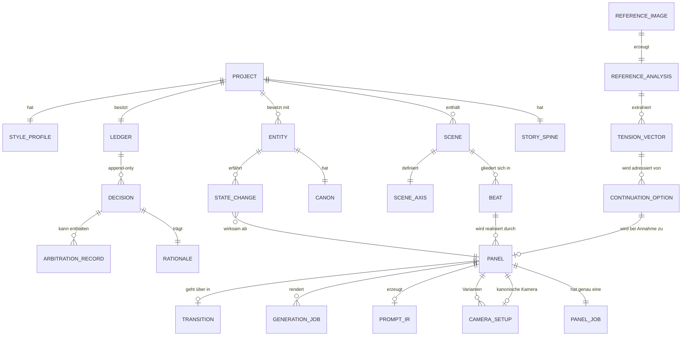

# 04 — Datenmodell

> Typskizzen sind **Spezifikation**. Sie legen Verträge und Pflichtfelder fest, nicht die
> Implementierung. Was hier nicht-optional ist, ist eine Invariante aus [00](00-REGIE-DOKTRIN.md).

---

## 1. Übersicht



---

## 2. Die drei Kernverträge

Alles im System hängt an drei Typen. Sie haben JSON-Schemata in [`schemas/`](../schemas/),
weil sie auch Agentenausgaben validieren müssen.

### 2.1 `Rationale` — das Warum (I4)

```swift
struct Rationale: Codable, Sendable, Hashable {
    let claim: String                 // Was wird entschieden? Ein Satz.
    let because: String               // Erzählerische Wirkung — nicht Geschmack.
    let grounds: [Ground]             // Belege, mind. 1
    let alternatives: [Alternative]   // Verworfenes mit Grund
    let confidence: Confidence        // 0…1 + Unsicherheitsquelle
    let author: Author                // .system(Module) | .agent(String) | .human
    let createdAt: Date
}

enum Ground: Codable, Sendable, Hashable {
    case beat(BeatID)                 // dramaturgischer Beleg
    case rule(RuleID)                 // Filmsprachregel aus dem Korpus
    case continuityFact(FactID)       // Zustand aus dem Graph
    case referenceFinding(FindingID)  // Befund aus der Bildanalyse
    case spine(SpineElement)          // Prämisse/Thema/dramatische Frage
    case humanDirective(String)       // ausdrückliche Nutzeranweisung
}

struct Alternative: Codable, Sendable, Hashable {
    let option: String
    let rejectedBecause: String       // Wirkung, die man nicht wollte
}

struct Confidence: Codable, Sendable, Hashable {
    let value: Double                 // 0…1
    let sourceOfDoubt: String?        // "Kostüm im Referenzbild teilweise verdeckt"
}
```

**Warum `grounds` typisiert und nicht Freitext:** Nur so ist Belegbarkeit maschinell prüfbar.
Ein `Ground`, der auf einen nicht existierenden Beat zeigt, fällt durch das Gate. Freitext
könnte man nur lesen, nicht prüfen — und ungeprüfte Begründungen verkommen zu Floskeln.

### 2.2 `ContinuationOption` — die begründete Fortsetzung (I3)

```swift
struct ContinuationOption: Codable, Sendable, Identifiable {
    let id: OptionID
    let title: String                        // "Der Blick zurück"
    let addresses: TensionVectorID           // genau einer
    let strategy: StrategyArchetype          // escalate, reveal, reverse, delay,
                                             // contrast, approach, consequence
    let arcPosition: ArcPosition             // wo im Bogen dieser Schritt liegt
    let expectedTensionDelta: Double         // −1…+1
    let panelJob: PanelJob                   // die eine Aufgabe des Folgepanels
    let cameraPlan: CameraPlan               // Intent + abgeleitete Parameter
    let continuityConstraints: [Constraint]  // was gleich bleiben MUSS
    let transition: TransitionPlan           // Typ + Begründung
    let promptIR: PromptIR                   // fertig, nicht "Prompt-Idee"
    let risks: [Risk]                        // was schiefgehen kann und warum
    let rationale: Rationale                 // Pflicht
}

struct TransitionPlan: Codable, Sendable {
    let kind: TransitionKind    // cut, matchCut, jumpCut, dissolve, wipe,
                                // smashCut, lCut, jCut, fade, whipPan
    let because: String         // warum genau dieser Übergang die Wirkung trägt
    let bridge: String?         // Match-Element bei matchCut (Form, Bewegung, Farbe, Ton)
}
```

**Warum `addresses` genau einen Vektor hat:** Eine Fortsetzung, die drei offene Fragen
gleichzeitig beantwortet, ist keine Regie, sondern eine Zusammenfassung. Ein Vektor pro
Option macht die Optionen außerdem vergleichbar — das ist die Voraussetzung für die
Diversitätsprüfung.

### 2.3 `Decision` — der Ledger-Eintrag

```swift
struct Decision: Codable, Sendable, Identifiable {
    let id: DecisionID
    let cursor: LedgerCursor          // monoton, definiert die Reihenfolge
    let branch: BranchID
    let kind: DecisionKind            // siehe 02, Abschnitt 3.1
    let payload: DecisionPayload      // typisiert je kind
    let rationale: Rationale          // Pflicht — kein Eintrag ohne Warum
    let arbitration: ArbitrationRecord?
    let supersedes: DecisionID?       // Korrektur statt Löschung
    let schemaVersion: Int
}
```

**Append-only, nie löschen.** Eine Korrektur ist ein neuer Eintrag mit `supersedes`.
Damit bleibt sichtbar, dass die Regie ihre Meinung geändert hat — und warum.

---

## 3. Erzählstruktur

```swift
struct Project {
    let id: ProjectID
    var title: String
    var spine: StorySpine
    var styleProfile: StyleProfile
    var template: StoryTemplateID       // aus story-templates.yaml
    var ruleOverlay: ProjectRuleOverlay // projektspezifische Regelabweichungen
    var aspect: AspectRatio
}

struct StorySpine {
    var premise: String
    var dramaticQuestion: String
    var protagonistGoal: String
    var antagonism: String
    var theme: String
    // fehlende Elemente ⇒ abgeleitete Beats tragen `groundingWeakness`
}

struct Scene {
    let id: SceneID
    var slug: String                    // "INT. WERKSTATT – NACHT"
    var location: EntityID
    var timeOfDay: TimeOfDay
    var weather: Weather?
    var axis: SceneAxis?                // etabliert durch ein Panel
    var beats: [BeatID]
    var dramaticFunction: String        // was die Szene im Ganzen leistet
}
```

**`Panel` — die atomare Einheit (I1):**

```swift
struct Panel {
    let id: PanelID
    let index: PanelIndex               // Reihenfolge innerhalb der Szene
    let beat: BeatID
    let narrativeJob: PanelJob          // GENAU EINE (I1)
    let compression: Compression?       // Ausnahmefall, begründungspflichtig
    var canonicalCamera: CameraSetupID?
    var cameraVariants: [CameraSetupID]
    var promptIR: PromptIRHash?
    var generations: [GenerationJobID]
    var transitionOut: TransitionPlan?
    var subjects: [EntityID]
    var notes: [Annotation]             // Pencil-Notizen, Regieanweisungen
}

enum PanelJob: String, Codable {
    case establish, introduce, state, intent, action, reaction
    case reveal, escalate, withhold, transition, punctuate, resolve
}
```

**Panel vs. Shot.** Ein Panel ist die *erzählerische* Einheit; ein `CameraSetup` ist ihre
kameratechnische Realisierung. Ein Panel kann mehrere Setups als Varianten tragen, aber genau
eines ist kanonisch. So bleiben Alternativen erhalten, ohne dass das Board mehrdeutig wird.

---

## 4. Kontinuität

```swift
struct Entity {
    let id: EntityID
    let kind: EntityKind        // character, location, prop, wardrobe,
                                // lightingSetup, vehicle, animal, effect
    var name: String
    var canon: Canon
    var referenceAssets: [AssetID]   // Character Sheet etc.
}

struct Canon {
    var description: String          // wörtliche Kanon-Formulierung für Prompts
    var distinctiveFeatures: [Feature]  // je mit Unterscheidungskraft-Score
    var doNotDepict: [String]        // Ausschlüsse (fließen in exclusions)
}

struct StateChange {
    let id: StateChangeID
    let entity: EntityID
    let property: StateProperty      // wardrobe, injury, wetness, emotion,
                                     // possession, position, lightState, timeState
    let value: StateValue
    let effectiveFrom: PanelIndex    // ab hier gültig
    let causedBy: EventRef?          // "Sturz in Panel 13"
    let rationale: Rationale
}

struct ResolvedState {              // Ergebnis einer Zeitachsen-Abfrage
    let entity: EntityID
    let at: PanelIndex
    let values: [StateProperty: StateValue]
    let provenance: [StateProperty: StateChangeID]   // wer hat es gesetzt
}
```

**Warum `effectiveFrom` statt absoluter Werte:** Anschlussfehler entstehen fast immer, weil
ein Zustand global gedacht wird („sie trägt den Mantel"), obwohl er einen Anfang und ein Ende
hat. Ein Modell, das Zustände nur an Entitäten hängt, kann diesen Fehler nicht einmal
darstellen — geschweige denn erkennen.

---

## 5. Kamera

```swift
enum ShotSize: String, Codable {
    case extremeWide, wide, fullShot, mediumWide, medium
    case mediumCloseUp, closeUp, extremeCloseUp, insert
}

struct FocalLength {
    let mm: Int
    var language: LensLanguage {      // abgeleitet, nicht frei gesetzt
        switch mm {
        case ..<24:   .distortedProximity   // Nähe, die unangenehm wird
        case 24..<40: .spatialContext       // Figur im Raum, Weite
        case 40..<58: .neutralWitness       // menschlicher Blick
        case 58..<100: .isolation           // Trennung vom Hintergrund
        default:      .compression          // Verdichtung, Ausweglosigkeit
        }
    }
}

struct CameraMovement {
    let kind: MovementKind          // static, pan, tilt, dolly, track, crane,
                                    // handheld, steadicam, zoom, pushIn, pullOut
    let motivation: MovementMotivation   // PFLICHT (FR-CI-08)
    let timing: MovementTiming?
}

enum MovementMotivation {
    case followsSubject(EntityID)
    case revealsFact(FactID)
    case appliesPressure           // Push-In auf steigende Spannung
    case releasesPressure
    case establishesGeography
    case subjectivePOV(EntityID)
    case intentionalUnmotivated(purpose: String)   // Verfremdung, bewusst
}

struct SceneAxis {
    let line: Angle
    let establishedBy: PanelID
    var validFrom: PanelIndex
    var brokenAt: [(PanelIndex, AxisBreakKind)]   // markiert oder intentional
}
```

`MovementMotivation` als Enum ohne Standardfall ist die Typumsetzung von FR-CI-08:
Eine Bewegung ohne Motivation lässt sich nicht konstruieren. Der Verfremdungsfall existiert,
kostet aber eine ausdrückliche Zweckangabe.

---

## 6. Referenz & Analyse

```swift
struct ReferenceAnalysis {
    let id: AnalysisID
    let asset: AssetID
    let technical: TechnicalRead        // Stufe 1
    let composition: CompositionRead    // Stufe 2
    let camera: CameraRead              // Stufe 3
    let content: ContentRead            // Stufe 4
    let narrative: NarrativeRead        // Stufe 5
    let dramaturgy: DramaturgyRead      // Stufe 6
    let tensionVectors: [TensionVector]
    let confidenceMap: [Stage: Double]  // je Stufe eigene Sicherheit
    let modelProvenance: [Stage: ModelDescriptorID]
}

struct TensionVector {
    let id: TensionVectorID
    let kind: TensionKind    // offscreenGaze, concealedObject, powerImbalance,
                             // approachingThreat, unspokenRelation, brokenSymmetry,
                             // interruptedAction, absentParty, temporalPressure
    let evidence: String     // was im Bild belegt das
    let strength: Double     // 0…1
    let openQuestion: String // die Frage, die das Bild stellt
}
```

**`confidenceMap` je Stufe, nicht global:** Ein Modell kann die Komposition sicher lesen und
die Erzählabsicht raten. Eine Gesamtzahl würde das verwischen — und die Begründungen, die
darauf aufbauen, hätten eine falsche Autorität.

---

## 7. Generierung

```swift
struct GenerationJob {
    let id: GenerationJobID
    let panel: PanelID
    let promptIRHash: String        // SHA-256 der kanonischen IR
    let rendererID: PromptRendererID
    let modelID: ModelDescriptorID
    let seed: UInt64?
    let ledgerCursor: LedgerCursor  // Zustand zum Zeitpunkt der Erzeugung
    let fidelityRisks: [FidelityRisk]
    var status: JobStatus
    var results: [AssetID]
    var postCheck: AnchorCheckResult?   // hält das Bild seine Anker?
}
```

Diese sieben Felder oben sind zusammen die Umsetzung von I5: Mit ihnen lässt sich jedes Bild
exakt reproduzieren oder erklären, warum es nicht reproduzierbar ist.

---

## 8. Versionierung & Migration

- Jede persistierte Datei trägt `schemaVersion`.
- Migrationen sind **vorwärtsgerichtete Funktionen** `migrate(vN → vN+1)`, verkettet angewandt.
- Ledger-Einträge werden **nie umgeschrieben**; alte `DecisionKind`s bleiben lesbar
  (deprecated, aber interpretierbar). Ein Ledger, dessen Vergangenheit man umschreibt,
  verliert genau die Eigenschaft, für die er existiert.
- Regelkorpus-Versionen sind Teil des `Ground`: `rule(RuleID)` referenziert
  `shot-grammar.v3#R-021`. Ändert sich eine Regel, bleibt die alte Begründung wahr —
  sie zeigt auf die Fassung, die damals galt.
