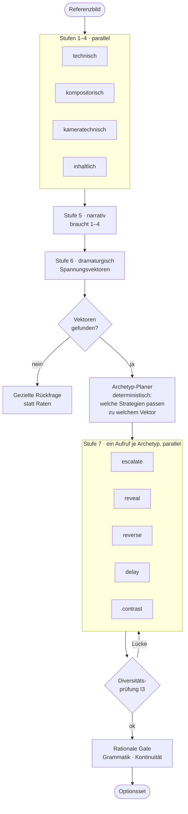
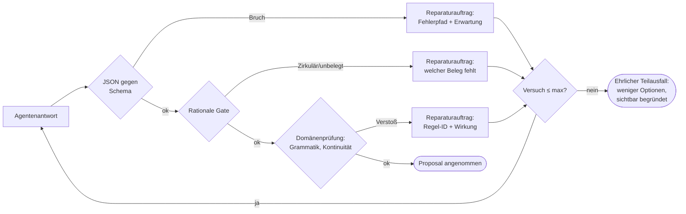

# 05 — Agentenstruktur

> Agenten schlagen vor. Sie entscheiden nicht. Der Unterschied ist die Architektur.

---

## 1. Grundregeln

1. **Kein Agent schreibt Zustand.** Jeder Output geht als `Proposal` an die Director Engine
   und durch dieselben Validatoren wie eine menschliche Eingabe.
2. **Kein Agent orchestriert.** Die Orchestrierung ist deterministischer Code
   (Zustandsmaschine), kein „Agent, der andere Agenten ruft". Begründung: Ein LLM-Orchestrator
   ist weder reproduzierbar noch debugbar noch kostenkontrollierbar.
3. **Jeder Agent hat ein Ausgabeschema.** Ungültiges JSON oder fehlende Rationale ⇒
   Reparaturauftrag, kein Durchwinken.
4. **Jeder Agent hat ein Budget.** Token, Latenz, Kosten, Retries — deklariert, nicht implizit.
5. **Kein Agent kennt sein Modell.** Er deklariert eine Fähigkeit; das Gateway wählt.

---

## 2. Roster

| Agent | Fähigkeit | Aufgabe | Temperatur | Retries |
|---|---|---|---|---|
| **ReferenceAnalyst** | `visionAnalysis` | 7-stufige Bildanalyse, Spannungsvektoren | 0,2 | 2 |
| **StoryAnalyst** | `textReasoning` | Beats, Wertwechsel, Subtext, Spannungswerte, Diagnosevorschläge | 0,4 | 2 |
| **CameraDramaturg** | `textReasoning` | Absicht → Kameravorschlag *innerhalb* der vom Regelkorpus erlaubten Bereiche | 0,3 | 2 |
| **ContinuationArchitect** | `textReasoning` | Fortsetzungsoptionen je Strategie-Archetyp | 0,7 | 2 |
| **ContinuityAuditor** | `textReasoning` + `visionAnalysis` | Widersprüche im Plan; Anker-Post-Check am erzeugten Bild | 0,1 | 1 |
| **PromptSmith** | `textReasoning` | Sprachliche Verdichtung der IR-Felder (nur Formulierung, keine Semantik) | 0,3 | 2 |
| **CritiqueAgent** | `textReasoning` | Advocatus Diaboli: Gegenargument zur gewählten Option | 0,6 | 1 |
| **DialogueAgent** | `textReasoning` | Der Director Assistant im Gespräch | 0,5 | 1 |

**Temperaturlogik:** Prüfende Agenten laufen kalt (0,1–0,2) — sie sollen konsistent urteilen.
Erzeugende Agenten laufen wärmer (0,6–0,7) — sie sollen Optionsräume öffnen. Der
`ContinuationArchitect` ist der einzige mit hoher Temperatur, und selbst dort wird die
Streuung durch die Archetyp-Vorgabe kanalisiert: **Varianz in der Formulierung, nicht in der
Strategie.**

---

## 3. Agentenvertrag

Jeder Agent implementiert dasselbe Protokoll:

```swift
protocol DirectorAgent {
    associatedtype Input: Codable & Sendable
    associatedtype Output: Codable & Sendable

    static var id: AgentID { get }
    static var capability: Capability { get }
    static var outputSchema: JSONSchema { get }
    static var budget: AgentBudget { get }

    func run(_ input: Input, context: BundledContext) async throws -> Proposal<Output>
}

struct AgentBudget {
    let maxInputTokens: Int
    let maxOutputTokens: Int
    let maxLatency: Duration
    let maxRetries: Int
    let costClass: CostClass
}
```

**`BundledContext`** ist nie „das Projekt", sondern ein kuratiertes Bündel — siehe Abschnitt 6.

---

## 4. Orchestrierung

Deterministische Zustandsmaschinen je Use Case. Beispiel *Referenzbild → Fortsetzungen*:



**Der entscheidende Kniff:** Der *Archetyp-Planer* ist deterministischer Code. Er entscheidet
anhand von Vektortyp, Beat-Funktion und Position im Bogen, **welche** Strategien überhaupt
sinnvoll sind — und ruft dann pro Strategie *einen* Agenten mit klarem Auftrag.

Der naive Weg wäre: „Gib mir fünf Fortsetzungen." Das liefert fünf Varianten derselben
naheliegenden Idee, weil das Modell auf den wahrscheinlichsten Pfad zusteuert. Die
Archetyp-Fächerung erzwingt strukturell verschiedene Antworten. Das ist die Umsetzung von
„Gib keine zufälligen Ergebnisse aus" — nicht durch mehr Sampling, sondern durch
**Abdeckung eines strukturierten Raums**.

---

## 5. Schema-Zwang und Reparaturschleife



**Der ehrliche Teilausfall** ist wichtig: Wenn nur drei von fünf Archetypen valide Optionen
liefern, zeigt SOULINK drei Optionen und den Hinweis, welche Strategien am Material
gescheitert sind — statt zwei schwache Optionen aufzufüllen. Auffüllen wäre exakt das
Zufallsverhalten, das SOULINK abschaffen soll.

---

## 6. Kontextbündelung

Jeder Agent bekommt ein maßgeschneidertes Bündel. Nie alles.

| Agent | Bündel |
|---|---|
| ReferenceAnalyst | Bild + Projekt-Stilprofil + (optional) Szenenkontext. **Kein** Story Spine in Stufen 1–4 — sonst projiziert das Modell die Erwartung ins Bild statt zu beobachten. |
| StoryAnalyst | Spine + Szene + Nachbarbeats + Figurenbögen |
| CameraDramaturg | Beat + PanelJob + Vorgänger/Nachfolger-Setup + Achsenzustand + erlaubte Parameterbereiche aus dem Regelkorpus |
| ContinuationArchitect | Analyse + **ein** Spannungsvektor + **ein** Archetyp + Beat + Kontinuitätszustand |
| ContinuityAuditor | Aufgelöster Zustand der beteiligten Entitäten + Kanon + betroffene Panels |
| DialogueAgent | Aktuelle Szene + letzte 10 Entscheidungen + offene Befunde + Spine |

**Die Trennung in Stufe 1–4 ohne Spine ist eine bewusste Entscheidung** und in
[10-ADR.md](10-ADR.md) als ADR-007 festgehalten: Erwartungsgetriebene Wahrnehmung ist der
häufigste Fehler bei VLM-Bildanalysen. Wer dem Modell die Geschichte vorher erzählt, bekommt
sie im Bild bestätigt — auch wenn sie nicht drin ist.

---

## 7. Systemprompt-Skelette

Nicht als fertiger Text, sondern als **Vertragsstruktur**. Jeder Agentenprompt hat dieselben
sechs Blöcke:

```
1. ROLLE          Enge Rolle, keine Allzweck-Persona.
                  "Du liest Bilder wie ein Kameramann. Du erzählst keine Geschichte dazu."
2. AUFTRAG        Genau eine Aufgabe. Kein "und außerdem".
3. MATERIAL       Der gebündelte Kontext, klar abgegrenzt und als Daten markiert.
4. REGELN         Die relevanten Regelauszüge aus dem Korpus, mit IDs.
5. AUSGABE        JSON-Schema, wörtlich. Keine Prosa außerhalb.
6. BEGRÜNDUNG     "Jedes Feld `rationale` braucht Wirkung + Beleg (Beat/Regel/Fakt).
                   'Weil es besser aussieht' ist ungültig und wird zurückgewiesen."
```

Beispiel `ContinuationArchitect` (verkürzt):

```
ROLLE:     Du bist Dramaturg. Du entwickelst genau EINE Fortsetzung nach genau EINER Strategie.
AUFTRAG:   Strategie = {archetype}. Adressierter Spannungsvektor = {vector}.
           Entwickle die Fortsetzung, die diese Strategie am konsequentesten verkörpert.
           Du darfst die Strategie nicht wechseln, auch wenn eine andere naheliegender wirkt.
MATERIAL:  {analysis} {beat} {continuityState} {styleProfile}
REGELN:    Übergangsgrammatik {transitionRules}; erlaubte Kameraabsichten {intents}
AUSGABE:   ContinuationOption (Schema anbei) — ein Objekt, kein Array.
BEGRÜNDUNG: `rationale.because` benennt die Wirkung beim Zuschauer.
           `grounds` referenziert mindestens den Vektor und einen Beat oder eine Regel.
           Bei `alternatives` nenne die naheliegende Fortsetzung, die du NICHT gewählt hast,
           und warum sie schwächer ist.
```

Der Satz *„Du darfst die Strategie nicht wechseln"* ist funktional: ohne ihn konvergieren
alle Aufrufe auf dieselbe naheliegende Fortsetzung.

---

## 8. Umgang mit Modellfehlern

| Fehlerbild | Erkennung | Reaktion |
|---|---|---|
| **Halluzinierter Beleg** | `Ground` zeigt auf nicht existente ID | Reparaturauftrag mit Liste gültiger IDs |
| **Floskel-Begründung** | Nicht-Zirkularitätsprüfung (Musterliste + semantische Prüfung) | Reparaturauftrag mit Negativbeispiel |
| **Strategie-Kollaps** | Zwei Optionen im Diversitätsmaß zu nah | Betroffene Optionen neu, mit expliziter Abgrenzung zur anderen |
| **Überkonfidenz** | `confidence` > 0,9 bei mehrdeutigem Bildbefund | Kalibrierungsregel dämpft; Unsicherheitsquelle wird erzwungen |
| **Schema-Drift** | Zusatzfelder, fehlende Pflichtfelder | Striktes Decoding, kein „best effort" |
| **Ausfall des Anbieters** | Timeout / Fehlerklasse | Gateway wechselt Modell bei erfüllter Fähigkeit, sonst Warteschlange + Weiterarbeit im deterministischen Teil |

---

## 9. Kosten- und Latenzbudget (Zielwerte)

| Ablauf | Aufrufe | Ziel-Latenz | Bemerkung |
|---|---|---|---|
| Referenzanalyse Stufen 1–4 | 4 parallel (1 Vision-Modell) | < 12 s | Teilergebnisse streamen ab ~3 s |
| Stufen 5–6 | 2 sequenziell | < 8 s | |
| Stufe 7 (5 Archetypen) | 5 parallel | < 10 s | |
| **Gesamt Referenz → Optionsset** | 11 | **< 25 s** | NFR-02 |
| Kamera-Vorschlag für ein Panel | 1 | < 3 s | Regelableitung selbst < 100 ms, lokal |
| Kontinuitätsaudit einer Szene | 1 | < 5 s | Harte Konflikte rein deterministisch, sofort |
| Assistant-Antwort | 1 | < 4 s bis erstes Token | Streaming |

**Sparsamkeitsregeln:** Analyseergebnisse werden am Asset gecacht (inhaltsadressiert);
deterministische Prüfungen laufen *vor* Modellaufrufen (ein Panel mit hartem
Kontinuitätskonflikt wird gar nicht erst zum Prompt); Abbruch beim Verlassen des Kontexts
storniert offene Aufträge.

---

## 10. Evaluation der Agenten

Jeder Agent hat ein Eval-Set (Details in [08](08-QUALITAET-NFR.md)):

- **ReferenceAnalyst:** annotierte Bilder mit Expertenlesung (Einstellungsgröße, Höhe,
  geschätzte Brennweite, Lichtsetup). Metrik: Übereinstimmungsrate je Feld.
- **ContinuationArchitect:** Referenzbilder mit von Regisseuren erstellten Fortsetzungssets.
  Metriken: Strategiedistanz, Begründungsqualität (Blindbewertung), Übernahmerate.
- **ContinuityAuditor:** Fixtures mit eingebauten Anschlussfehlern. Metriken: Erkennungsrate,
  Falsch-Positiv-Rate (letztere ist kritischer — ein Werkzeug, das ständig grundlos warnt,
  wird ignoriert).
- **CameraDramaturg:** Beats mit Expertenlösung. Metrik: Übereinstimmung mit dem
  Regelkorpus + Zustimmungsrate von Fachleuten.

**Regressionsschutz:** Prompt- und Modelländerungen laufen gegen das Eval-Set, bevor sie
ausgeliefert werden. Die Ergebnisse werden pro Modellversion gespeichert — so ist auch
sichtbar, wenn ein Anbieter sein Modell still ändert.
