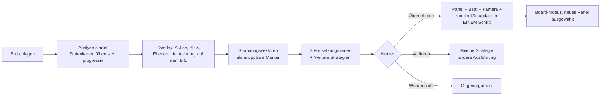

# 06 — UX-Konzept (iPad)

> Die zentrale UX-These: **Das Warum ist kein Detail-Panel, sondern eine permanente Zone
> der Oberfläche.** Wenn die Begründung erst nach einem Tap sichtbar wird, ist sie optional.
> Was optional ist, wird ignoriert. Was ignoriert wird, verkommt.

---

## 1. Gestaltungsprinzipien

| # | Prinzip | Konsequenz |
|---|---|---|
| G1 | **Warum immer sichtbar, nie blockierend** | Der Reasoning Inspector ist dauerhaft eingeblendet, aber niemals ein Modal. Man kann arbeiten, ohne zu lesen — aber nicht, ohne es zu sehen. |
| G2 | **Ein Panel, eine Aufgabe — auch im UI** | Jede Fläche hat genau eine Rolle. Keine Zone tut zwei Dinge. Das Prinzip aus I1 gilt für die Oberfläche selbst. |
| G3 | **Struktur vor Bild** | Das Board zeigt Aufgabe, Kamera und Spannung *auch ohne* generierte Bilder. Ein Board ohne Bilder ist arbeitsfähig; das Bild ist Illustration der Entscheidung. |
| G4 | **Optionen als Karten, nie als Liste** | Fortsetzungen sind Regieangebote, keine Suchergebnisse. Karte = Begründung, Kamera, Risiko, Übergang auf einen Blick. |
| G5 | **Direkte Manipulation vor Formularen** | Achse ziehen, Kamera auf dem Grundriss setzen, Spannungskurve mit dem Pencil formen. |
| G6 | **Maximal drei Optionen unaufgefordert** | Entscheidungsermüdung ist ein Regie-Feind. Mehr auf Anforderung („zeig mir die anderen Strategien"). |
| G7 | **Ehrlichkeit über Unsicherheit** | Konfidenz und `FidelityRisk` sind sichtbare Bildzeichen, keine versteckten Metadaten. |

---

## 2. Grundlayout

Drei Zonen, quer über alle Modi stabil. Landscape ist der Hauptfall (iPad am Ständer,
Pencil in der Hand).

```
┌──────────────────────────────────────────────────────────────────────────────┐
│  Titelleiste:  Projekt · Szene · Modus-Umschalter · Ledger-Cursor · Generieren │
├───────────────┬──────────────────────────────────────────┬───────────────────┤
│               │                                          │                   │
│  STORY        │            STAGE                         │   REASONING       │
│  NAVIGATOR    │                                          │   INSPECTOR       │
│               │   modusabhängig:                         │                   │
│  Akte         │   Board · Szene · Panel · Grundriss ·     │   Warum-Kette     │
│  Sequenzen    │   Referenzanalyse · Kontinuität          │   Belege          │
│  Szenen       │                                          │   Alternativen    │
│  Beats        │                                          │   Konflikte       │
│  Panels       │                                          │   Risiken         │
│               │                                          │   Konfidenz       │
│  ~280 pt      │            flexibel                      │   ~360 pt         │
├───────────────┴──────────────────────────────────────────┴───────────────────┤
│  Spannungskurve (immer sichtbar, scrubbar, zeigt aktuelle Position)          │
└──────────────────────────────────────────────────────────────────────────────┘
```

**Warum die Spannungskurve permanent unten liegt:** Sie ist die einzige Ansicht, die
Dramaturgie als *Verlauf* zeigt. In einem Werkzeug, das Einzelbilder erzeugt, ist die
größte Gefahr, den Bogen aus dem Blick zu verlieren. Die Kurve ist die ständige Erinnerung
daran, dass man an einer Kurve arbeitet, nicht an einem Bild.

**Portrait / kompakt:** Inspector wird zur einziehbaren rechten Lade, Navigator zum
Aufklapp-Menü. Die Kurve bleibt. **Stage Manager & externer Bildschirm:** Board auf extern,
Inspector + Navigator auf dem iPad — der klassische Regie-Aufbau (Board an der Wand,
Notizen in der Hand).

---

## 3. Modi

Genau fünf. Jeder hat eine Aufgabe (G2).

| Modus | Aufgabe | Stage zeigt |
|---|---|---|
| **Story** | Struktur bauen und diagnostizieren | Beat-Karten mit Funktion, Wertwechsel, Subtext; Diagnosebefunde inline |
| **Board** | Panelfolge überblicken und ordnen | Raster aus Panelkarten: Aufgabe, Kamera-Kurzformel, Miniatur, Übergangssymbol |
| **Panel** | Ein Panel zu Ende entscheiden | Großes Bild/Platzhalter, Kamerawerkzeuge, Anker, Prompt-Vorschau, Varianten |
| **Grundriss** | Räumliche Wahrheit herstellen | 2D-Draufsicht: Figuren, Kamerapositionen, Achse, Blickrichtungen — Pencil-editierbar |
| **Referenz** | Bild lesen und fortsetzen | Analysebefunde als Overlay auf dem Bild + Fortsetzungskarten |

Moduswechsel behält immer die Auswahl bei: Bin ich in Panel 12 und wechsle nach Grundriss,
sehe ich Panel 12 im Raum. Kontextverlust bei Moduswechsel ist der häufigste Grund, warum
Kreativwerkzeuge sich schwerfällig anfühlen.

---

## 4. Schlüsselansichten

### 4.1 Panelkarte (Board-Modus)

```
┌────────────────────────────────┐
│ ▸ 12   ENTHÜLLUNG              │  ← die eine Aufgabe, immer sichtbar (I1)
│ ┌────────────────────────────┐ │
│ │                            │ │
│ │        Bild / Platzhalter  │ │  ← Platzhalter zeigt Kameraskizze,
│ │                            │ │     nicht "leer"
│ └────────────────────────────┘ │
│ CU · 85mm · leicht unter · fix │  ← Kamera-Kurzformel
│ ⟶ Match Cut auf die Hand       │  ← Übergang nach außen
│ ⚠ Achse  ◔ 0.72  ◈ Drift-Risiko│  ← Befunde, Konfidenz, Fidelity-Risk
└────────────────────────────────┘
```

Die Karte trägt **vier Informationsschichten**: Aufgabe, Bild, Kameraentscheidung, Zustand.
Ein Board, das nur Bilder zeigt, ist ein Moodboard — genau das, was SOULINK ersetzt.

### 4.2 Reasoning Inspector

Immer dieselbe Struktur, egal was ausgewählt ist:

```
WARUM
  Naheinstellung, 85 mm, leicht untersichtig.

WEIL
  Die Enthüllung muss ohne räumliche Ablenkung lesbar sein; die leichte
  Untersicht gibt Mara in diesem Moment die Kontrolle zurück.

BELEGE
  ▸ Beat B12 · Wertwechsel Vertrauen → Verrat
  ▸ Regel R-021 · shot-grammar v3
  ▸ Kontinuität · Mara trägt den Mantel seit Panel 9
  ▸ Referenzbefund · Blick aus dem Bild links

VERWORFEN
  Große Nahaufnahme — hätte den Höhepunkt in B14 vorweggenommen.
  Halbtotale — Information ginge im Raum unter.

KOSTEN DIESER ENTSCHEIDUNG
  Die räumliche Orientierung geht verloren; Panel 13 muss sie zurückgeben.

KONFIDENZ  0.78 · Unsicherheit: Lichtsetup im Referenzbild teilweise verdeckt
```

Der Block **„Kosten dieser Entscheidung"** kommt aus dem `ArbitrationRecord`. Er ist das,
was die meisten Werkzeuge verschweigen — und das, was ein Regisseur wirklich wissen will.

### 4.3 Fortsetzungskarte (Referenz-Modus)

```
┌──────────────────────────────────────────────────────────┐
│  UMKEHRUNG                          Spannung  +0.18  ↑   │
│  „Der Beobachter wird beobachtet"                        │
├──────────────────────────────────────────────────────────┤
│  [Vorschaubild / Kameraskizze]                           │
├──────────────────────────────────────────────────────────┤
│  ADRESSIERT   Blick aus dem Bild (links, Stärke 0.8)     │
│  AUFGABE      Enthüllung                                 │
│  KAMERA       Gegenschuss, MS → 50 mm, Achse gewahrt     │
│  ÜBERGANG     Harter Schnitt — die Wendung braucht Härte │
│  BEDINGUNGEN  Mantel nass · Regen hält an · Nacht        │
│  RISIKO       Modell verliert Narbe (Anker verstärkt)    │
├──────────────────────────────────────────────────────────┤
│  WARUM  Das Bild fragt, wen sie ansieht. Diese Option    │
│  beantwortet die Frage, indem sie sie umdreht: nicht     │
│  wen sie ansieht, sondern wer sie ansieht.               │
├──────────────────────────────────────────────────────────┤
│  [ Übernehmen ]  [ Variieren ]  [ Warum nicht? ]         │
└──────────────────────────────────────────────────────────┘
```

**„Warum nicht?"** ruft den CritiqueAgent: das Gegenargument zur eigenen Option. Ein
Werkzeug, das nur für sich argumentiert, ist ein Verkäufer. Ein Co-Regisseur widerspricht.

### 4.4 Grundriss-Modus

2D-Draufsicht, Pencil-nativ:

- Figuren als beschriftete Marker, Blickrichtung als Kegel
- Kamerapositionen mit Bildfeld (Brennweite → Öffnungswinkel, maßstäblich)
- **Achse als durchgehende Linie**; die verbotene Halbebene wird beim Ziehen einer neuen
  Kamera live eingefärbt — der Achsensprung wird *fühlbar*, nicht nur gemeldet
- Bewegungen als Bézier-Pfade mit Zeitmarken
- Zwei-Finger-Tap: Wechsel zwischen Draufsicht und Kamerablick (Vorschau der Perspektive)

Das ist die stärkste Rechtfertigung für iPad statt Desktop: Blocking zeichnet man, man
tippt es nicht in ein Formular.

### 4.5 Kontinuitätsmodus

Zeitachse mit Entitätszeilen (wie eine Timeline im NLE, aber Zustände statt Clips):

```
            P8   P9   P10  P11  P12  P13  P14
Mara ─────  ▓▓▓▓▓▓▓▓▓▓▓▓▓▓▓▓▓ Mantel ▓▓▓▓▓▓▓▓▓▓▓
            ······ trocken ····│▒▒▒ nass ▒▒▒▒▒▒▒▒   ← Änderung ab P11, Ursache: Regen
Ort ──────  ▓ Werkstatt ▓▓▓▓▓▓▓│▓▓▓▓ Hof ▓▓▓▓▓▓▓▓
Licht ────  ▓ Praktikables ▓▓▓▓│⚠ Sprung ohne Übergang
Zeit ─────  ▓▓▓▓▓ Abend ▓▓▓▓▓▓▓▓▓▓▓▓▓▓▓▓▓▓▓▓▓▓▓▓▓
```

Konflikte erscheinen an der Stelle, an der sie entstehen — nicht in einer Fehlerliste. Ein
Antippen zeigt Ursache, Wirkung beim Zuschauer und drei Reparaturwege.

---

## 5. Apple Pencil

| Geste / Werkzeug | Funktion |
|---|---|
| Zeichnen auf Panel | Annotation (Blocking, Kaschierung, Notiz) — bleibt als `Annotation` am Panel |
| Zeichnen auf Grundriss | Positionen, Wege, Achse setzen |
| Ziehen auf der Spannungskurve | Ziel-Spannung eines Beats setzen → Story Engine schlägt Anpassung vor |
| Doppeltipp (Pencil) | Wechsel Zeichnen ↔ Auswahl |
| Squeeze (Pencil Pro) | Schnellmenü: Aufgabe ändern · Kamera ableiten · Warum anzeigen |
| Scribble | Textfelder (Subtext, Prämisse, Notiz) handschriftlich |
| Hover | Vorschau: Panel unter dem Stift zeigt Kamera-Kurzformel groß |

**Regel:** Alles per Pencil Erreichbare ist auch per Finger erreichbar (NFR-08). Der Pencil
beschleunigt, er ist keine Voraussetzung.

---

## 6. Kernabläufe

### 6.1 Referenzbild → Panel (Flaggschiff)



**Progressive Enthüllung:** Nach ~3 s stehen technische und kompositorische Befunde, nach
~12 s die Kameralesung, nach ~20 s die Vektoren, nach ~25 s die Optionen. Der Nutzer liest
mit, statt einen Spinner anzusehen. Jede Stufe ist für sich nützlich — das ist die
UX-Rechtfertigung für die Stufentrennung.

### 6.2 Achsenkonflikt

1. Nutzer setzt Kamera jenseits der Achse (Grundriss oder Panel).
2. Die verbotene Halbebene färbt sich **während** der Bewegung — Feedback vor dem Fehler.
3. Beim Loslassen: Karte mit Regel R-011, Wirkung („Figuren springen für den Zuschauer die
   Seiten"), drei Wege: *Achse neu etablieren* · *Neutrale Einstellung einziehen* ·
   **„Bewusst so"**.
4. „Bewusst so" verlangt einen Satz Zweck → `intentionalViolation`. Danach markiert das Panel
   dauerhaft ein Zeichen: bewusster Bruch, nicht Fehler.

Das ist die UX-Übersetzung der Doktrin: SOULINK verbietet nie, es verlangt Absicht.

---

## 7. Zustände, Fehler, Warten

| Zustand | Darstellung |
|---|---|
| **Analyse läuft** | Stufenkarten mit Skelett; jede Stufe wird einzeln „scharf" |
| **Modell nicht erreichbar** | Banner: „Vorschläge pausiert. Struktur, Grammatik und Kontinuität arbeiten weiter." + Warteschlange |
| **Fidelity-Risiko** | Diamant-Zeichen am Panel, Antippen erklärt, welche Fähigkeit fehlt und was das kostet |
| **Anker nicht gehalten** (Post-Check) | Bild bekommt eine Randmarkierung + Vergleich Kanon vs. Bild nebeneinander |
| **Teilausfall Optionen** | „3 von 5 Strategien tragen an diesem Material. Nicht tragfähig: Verzögerung, Kontrast — Begründung antippen." |
| **Leeres Projekt** | Kein leeres Raster, sondern eine Frage: „Worum geht es? Ein Satz genügt." → Spine |

---

## 8. Barrierefreiheit

- **VoiceOver:** Jede Panelkarte liest Aufgabe → Kamera → Warum. Die Begründung ist Teil des
  Labels, nicht des Hints — sie ist Inhalt, nicht Zusatz.
- **Dynamic Type** bis XXL in allen Textzonen; das Board wechselt bei großen Größen von
  Raster auf Liste.
- **Farbunabhängigkeit:** Konflikte, Risiken und Konfidenz sind immer auch durch Form und
  Text kodiert. Rot allein bedeutet nie etwas.
- **Reduzierte Bewegung:** Übergänge werden zu Überblendungen, die Kurve scrollt statt zu federn.
- **Vollständige Bedienbarkeit ohne Pencil** und mit externer Tastatur (Kurzbefehle für
  Modi, Panel-Navigation, „Warum anzeigen").

---

## 9. Was bewusst fehlt

- **Kein Prompt-Textfeld an prominenter Stelle.** Der Prompt ist Ausgabe, nicht Eingabe.
  Er ist einsehbar und editierbar (im Panel-Modus, zweite Ebene) — aber wer ihn dort ändert,
  ändert eine Entscheidung, und das wird als solche protokolliert.
- **Keine Galerie „schöner Ergebnisse"** ohne Kontext. Bilder existieren nur an Panels.
- **Kein Zufallsknopf.** Es gibt „Variieren" — mit gleicher Strategie und neuem Seed,
  protokolliert. Der Unterschied ist die ganze Produktidee.
